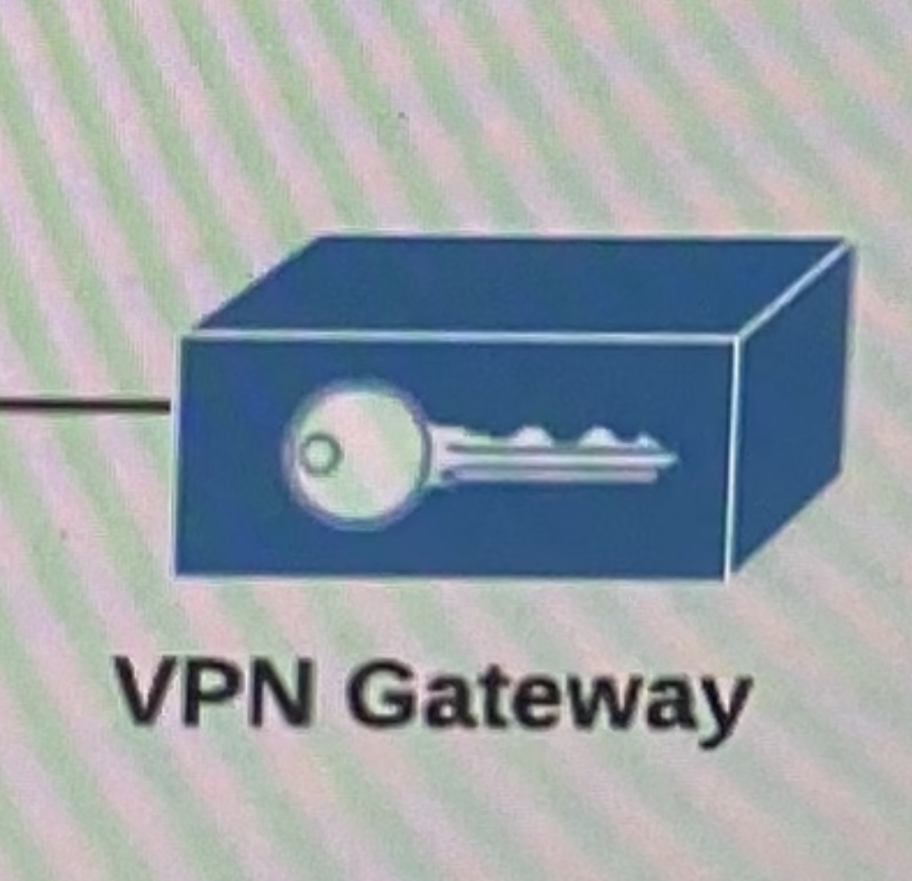

VPC Virtual Private Cloud
In VPS there will be a lot of networking. 

You can build your own networks
VPC is a logical data center within an AWS Region.
Virtual private could is an condemned configurable pool of shared computing resources allocated within a public cloud environment.

Control over  network environment, select IP address range, subnets and configure route tables and gateways.

IPv4 Address:
PIv4range :
0.0.0.0 - 255.255.255.255

Public IP = Internet
  E: 54.86.23.90
Private IP for local network design
  E: 192.168.1.10

Private IP ranges
  Class A 10.0.0.0 - 10.255.255.255
  Class B 172.16.0.0 - 172.31.255.255
  Class C 192.168.0.0 - 192.168.255.255

Subnet Masks
 What is subnet masks? And what it do? And why is it necessary? 
  255.0.0.0
  255.255.0.0
  255.255.255.0

 CIDR:
  255.255.255.0
  1111111.11111111.11111111.00000000

  VPC Setup Details/ Design & Components
VPC Range 172.20.0.0/16
Region: us-west-1
4 subnets: 2 public subnets, and 2 private subnets 
2 zones: us-west-1a, us-west-1b
172.20.1.0/24 => public-subnet1 [us-west-1a]
172.20.2.0/24=> public-subnet2 [us-west-1b] 
172.20.3.0/24 => private-subnet1 [us-west-1a]
172.20.4.0/24=> private-subnet2 [us-west-1b]
1 internet gateway => public subnet
2 Nat Gateway => private subnet (always have 2 NAT Gateway, when doing high availability. minimum of two NAT Gateway distributed in different zones)
1 ELP elastic IP (will be assigned to NAT gateway) 
2route Tables: 1 pub Sub RT, 1 Public Subnet Rout Table.
1 Bastion host in Public subnet
NACL (network access control list, it’s a security group with more control for public subnet)
1 move VPC => VPC Peering (in the second VCP I will peer my main VCP)

  

This is a basic PVC design. VPC is a main network. Where you divided into smaller subnets.

Two kind of subnets in VPC public & private subnet.
Public subnet is the on that can be reached to the internet, EC2 in a public subnet go to the Internet Internet can come to your EC2 to instant.

Internet Gateway manages flow to a public internet connection

Private Subnet: Traffic cannot cannot directly into the private subnet. You will not have any public IP’s. 
If private EC2 instance wants to access the internet, it will connect to the NAT gateway in the public subnet.

NAT gateway is like a WIFI router. You can connect private EC2 instance to your NAT gateway, but for the internet you cannot connect to toy NAT gateway. 
NAT gateway lives in the public subnet, it keeps traffic that originates from private subnets can go to the internet & the same traffic will be coming back but the traffic that is origination on the internet cannot get into your private subnet.

 How EC2 instance in a subnet, knows it has to go to the Internet gateway or it has to go to the NAT gateway. 

This is decided by the route table. There is a Route Table which you attach to your subnet. And the route table will tell EC2instance that it has to forward the traffic to the Internet gateway or a private subnet needs to go to the internet, the route table will tell it has to go to the NAT gateway. Internet gateway & NAT gateway both are routers. But internet gateway is for the direct to and flow internet connection. NAT gateway if for only traffic that goes to Internet.

If connecting to Private subnet directly form corporate data center. You can have a  NAT gateway. When diling the VPN, you connect to your instances with their private IP’s from your own network.